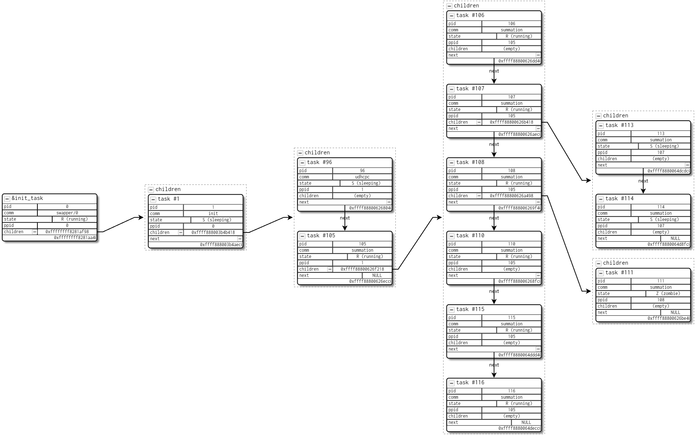
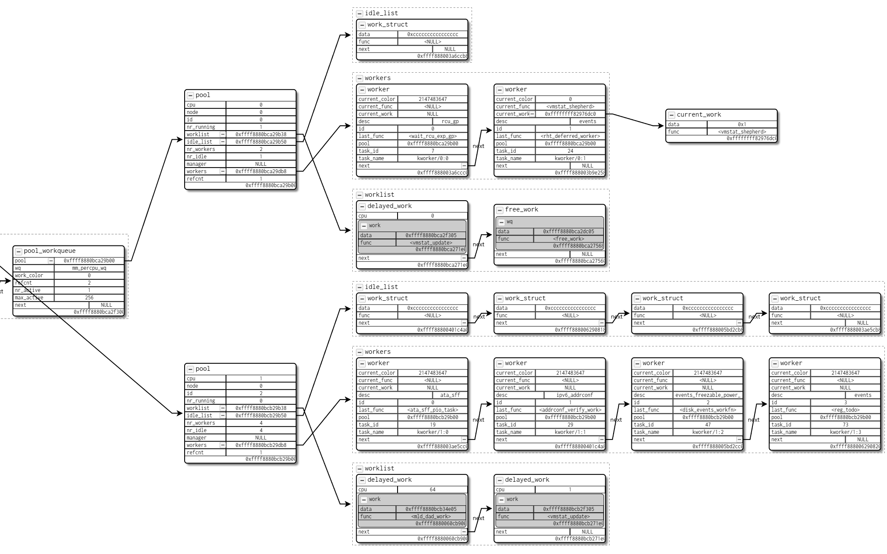
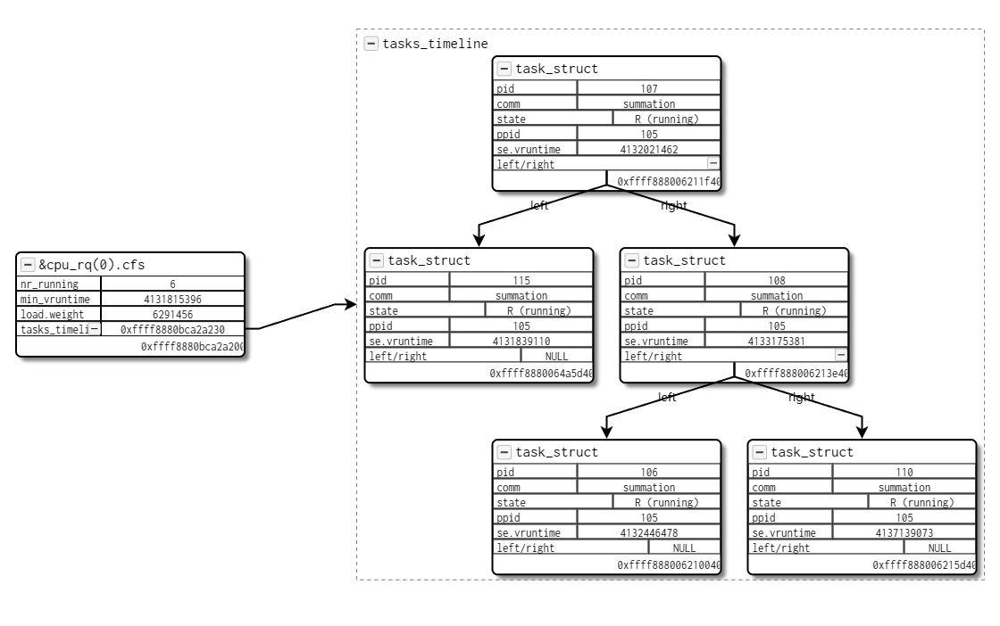
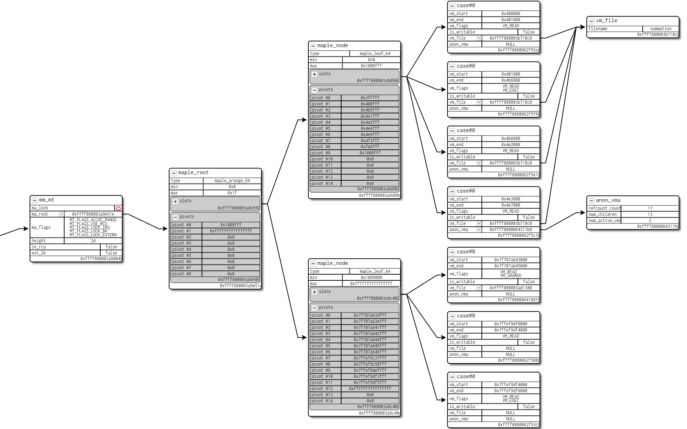
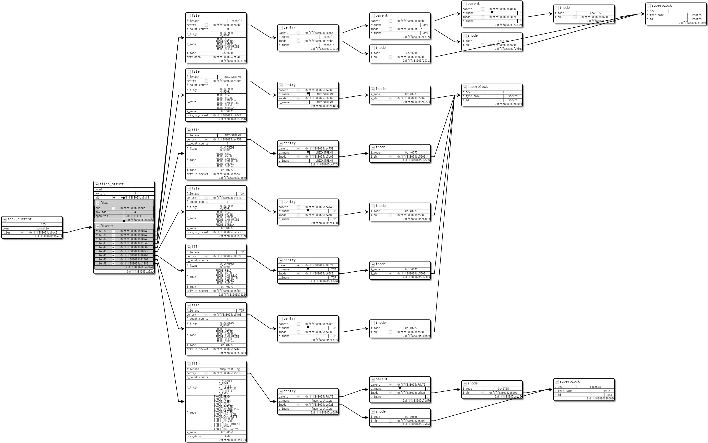
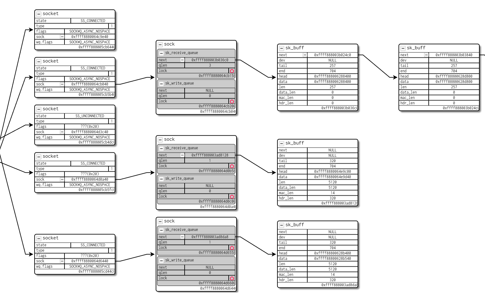
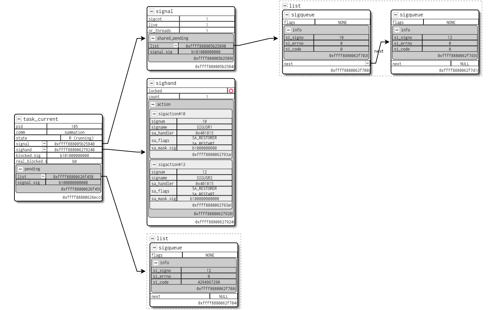
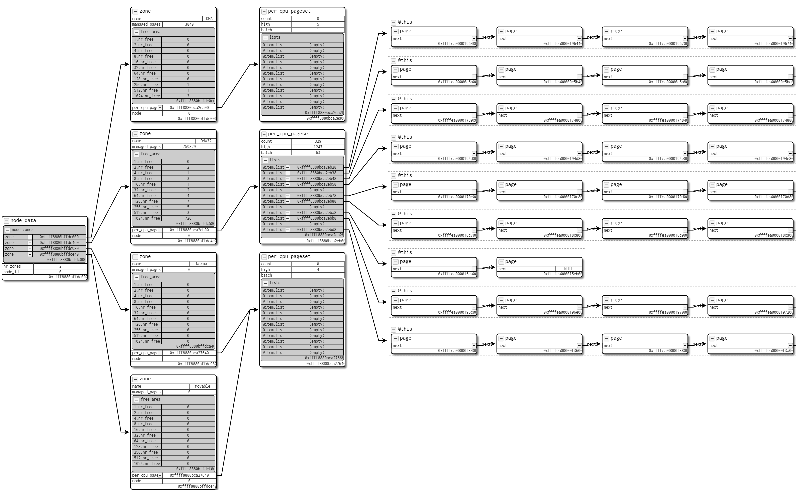
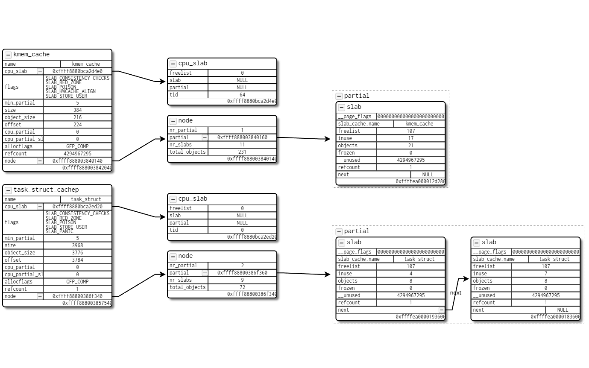

# Visualinux

Visualinux is the first debugging framework that can simplify the program state of Linux kernel to the extent that one can visually understand with low programming complexity and efforts. Our work has been accepted by EuroSys 2025 (doi forthcoming).

<div>
    <a href="docs/assets/01-process_tree.png"></a>
    <a href="docs/assets/02-workqueue.png"></a>
    <a href="docs/assets/03-runqueue.png"></a>
    <a href="docs/assets/04-addrspace.png"></a>
    <a href="docs/assets/05-proc_vfs.png"></a>
    <a href="docs/assets/06-socket.png"></a>
    <a href="docs/assets/07-signals.png"></a>
    <a href="docs/assets/08-buddy_system.png"></a>
    <a href="docs/assets/09-kmem_cache.png"></a>
</div>

To make it easy to get started, this repo provides an out-of-the-box kernel debugging environment with Visualinux enabled. You can also easily integrate Visualinux into your own debugging workflow (see [Standalone Deployment](#standalone-deployment)).

For artifact evaluation, we also provide an online environment to reproduce the textbook evaluation results of our paper submission (see [Online Artifact Evaluation](#online-artifact-evaluation)).

This README only describes how to deploy and use Visualinux. Please refer to `docs/` for technical details such as [source code organization](docs/src-orgn.md).

## Online Artifact Evaluation

We have prepared an online site for quick experience of Visualinux. You can painlessly enter a Visualinux-enabled debugging environment through an html page (the link is placed in Artifact Appendix of our AE submission to avoid numerous access conflicts from the outside).

After startup, the online instance will print introductory messages and then automatically evaluate a simple example (a process parent tree) at a predefined breakpoint. You can follow the section [Reproduce the Evaluation](#reproduce-the-evaluation) to reproduce the evaluation results, or feel free to debug the Linux kernel with the help of Visualinux.

Please note that due to resource limitations of our server, the online site only allows one connection at a time. It will temporarily stop working if multiple connections are simultaneously present.

*Single-blind review: We guarantee that there is no login activity in the online site and we do not track any visitor's IP address. You can also use a proxy to further hide your identity.*

Of course, artifact evaluators can also deploy Visualinux on their native machines. Please check the following sections for details.

## Requirements

Visualinux is fully compatible to gdb and it is available as long as one can debug the Linux kernel through gdb with python extension enabled. Requirements of our prototype implementation are:

- Python 3.10+

- Node.js 18+

- Linux kernel 6.1.X (otherwise Visualinux is still available, but some of our default VKern code might need to be rewritten due to the kernel version difference)

The tool has been well-tested on a Ubuntu 22.04 host with Python 3.10.12 and Node.js v18.20, with both gdb (QEMU) and kgdb (rpi-400) targeting on Linux kernel 5.15 and 6.1.25.

## Build

### Initialization

This repo provides a one-click initialization script. It generates the same environment as the evaluation in our paper. Specifically, it (1) installs python and node.js requirements, (2) fetchs busybox and linux kernel source, and (3) prepares a vscode development environment. You can use the second script if you do not use VSCode when debugging the Linux kernel.

```
./scripts/inienv.sh default
./scripts/inienv-no-vscode.sh default
```

After that, you can build the kernel, the workload and the visualizer:

```
make build
(cd visualizer/ && npm install)
```

### Manual Configuration

First, please make sure your gdb is able to auto-load gdb scripts and extensions (`kernel/vmlinux-gdb.py`, `scripts/config.gdb` and `visualinux-gdb.py`), e.g. check if they are in your gdb auto-load safe-path. Otherwise you have to manually load these scripts in each new debugging session.

```
To enable execution of this file add
  add-auto-load-safe-path <project_dir>/kernel/scripts/gdb/vmlinux-gdb.py
  add-auto-load-safe-path <project_dir>/scripts/gdb/config.gdb
  add-auto-load-safe-path <project_dir>/visualinux-gdb.py
lines to your configuration file "\~/.config/gdb/gdbinit".
To completely disable this security protection add
   set auto-load safe-path /
line to your configuration file "\~/.config/gdb/gdbinit".
```

Second, you should configure the following private information if necessary: just create a file `.env.local` in the project directory (same location as `.env`), and Visualinux will parse it. If not provided, Visualinux can work correctly with the relevant features disabled.

- `OPENAI_API_KEY`, `OPENAI_API_URL` and `OPENAI_API_MODEL` are used for LLM connection. If not provided, all LLM chat APIs will be disabled (e.g. `vchat`).

- `VISUALINUX_LOCALHOST_IP` is the public IP of your machine. It is only useful if you want to use the unified public web page as the front-end of Visualinux (see below).

```
OPENAI_API_KEY = deadbeef
OPENAI_API_URL = https://api.openai.com
OPENAI_API_MODEL = gpt-4
VISUALINUX_LOCALHOST_IP = xxx.xxx.xxx.xxx
```

### Standalone Deployment (Optional)

Although this repo provides an out-of-the-box environment, it is easy to integrate Visualinux into your own debugging workflow. Actually, the only essential components of this repo are the gdb extension (`visualinux-gdb.py`, `visualinux/` and `scripts/gdb/`) and the visualizer app (`visualizer/`). Most of the aforementioned scripts and commands is not mandatory to use; you only need to meet the following requirements (most of them are trivial):

- gdb with python extension enabled (which is the default configuration of gdb).

- python packages listed in `scripts/py-requirements.txt` installed.

- npm package requirements in `visualizer/` installed.

- Linux kernel compiled with debug info enabled, and compiled/runned with KASLR disabled.

- workload that can be used as initramfs or init disk image.

After that, you can just integrate Visualinux as a normal gdb python extension (with the auxiliary gdb scripts) and a normal node.js application.

## Tool Startup

This repo provides three different ways to startup Visualinux. You can choose your favourite one.

### Traditional Workflow

Visualinux is designed to be an auxiliary tool and does not interfere with the typical gdb workflow. Thus, you can start the gdb host and stub in separate terminals as usual:

```
make start    # in terminal 1
make attach   # in terminal 2
```

And start the visualizer app in another terminal:

```
cd visualizer/
npm run dev
```

You can access the visualizer app through `http://localhost:9802` (the port can be configured in `.env`).

### VSCode Workspace

This repo already provides VSCode configuration files. Therefore, after running our initialization script, you can open the vscode workspace in `.vscode/visualinux.code-workspace` and directly launch a Visualinux-enabled debugging session.

After launching the task, two panels will appear in VSCode: one for the gdb-qemu instance, and another for the visualizer app. Terminating the debugging session will stop all of them.

You can access the visualizer app through `http://localhost:9802` (the port can be configured in `.env`). 

### Unified Public Web Page

We also provide another solution that utilizes ttyd to merge gdb-qemu and visualizer together on a simple web page. You can initialize and launch it through the following commands:

```
apt install tmux ttyd
(cd page/ && npm install)
./page/start.py
./page/start.py --public
```

By default, you can access the web page through port 3000. If you invoke `.start.py` with `--public` option, it will map it to port 80, which may require root user privileges or some environment-level configuration to work.

Since ttyd doesn't work for localhost in several circumstances, please fill in `VISUALINUX_LOCALHOST_IP` in `.env.local` with your public IP.

## Usage

### Quick Start

Set a breakpoint anywhere; when the execution is paused, invoke the following command in gdb to plot the process parent tree on the visualizer:

```
vplot -f evaluation/textbook/01_process_parenthood.vkern
```

*Note that invoking gdb commands in VSCode terminal requires a `-exec` prefix. For example, `vplot -f foo.vkern` should be `-exec vplot -f foo.vkern`.*

### How Visualinux Works

Visualinux consists of a gdb extension and a visualizer. The gdb extension does not change the typical gdb workflow, but adds a set of CLI-like commands to the gdb interface, which we call **v-commands**. We will briefly introduce their usage later.

The visualizer is an independent node app. For v-commands invoked, the gdb extension will notify the visualizer via HTTP POST requests, and then the front-end visualization will be refreshed. For example, `vplot` converts the object graphs into a JSON object and send it to the visualizer.

Note that the gdb extension will be loaded on the first halt (e.g. reaching a breakpoint) and print messages to indicate the successful initialization. If you encounter any initialization issues in your environment (e.g. if gdb complains that the command `vplot` does not exist), you can try to check the entry script `scripts/gdb/config.gdb` to get more details to find the root cause.

### V-Commands

Whenever the execution is paused, you can execute the v-commands as the normal commands of gdb, including `vplot`, `vctrl` and `vchat`.

**vplot** extracts object graphs given a VKern source file (from `vkern/` of the project), or it can synthesize naive VKern code for simple usages.

- `vplot -f evaluation/cases/dirty-pipe.vkern`

- `vplot p { pid, comm }`

- `vplot --chat plot p with fields pid, comm`

**vctrl** controls the panes and the views displayed on panes of the visualizer. For instance, split an existed pane to create a new one, or apply a VQL request on a view. VQL programs can be synthesized via LLM API.
 
- `vctrl split 1 -d h`

- `vctrl chat split the first pane horizontally`

- `vctrl chat in pane #4, find me all vm_area_struct whose address is not 0xffffffffff871a20, and shrink them`

**vchat** is a unified LLM chat API. The prompt is designed to classify the message as either `vplot` or `vctrl`, and convert it into a well-formed command.

Please check the help messages in gdb for more details of usages, e.g. invoking `vplot --help`.

### Reproduce the Evaluation

#### Reviving and Beyond the Textbook

Assume that you have used our initialization scripts, you can easily reproduce the textbook results (section 5.1 and 5.2) in our paper:

- Set a breakpoint on the function `security_task_getsid`, then let it continue.

- When the execution is first paused there, invoke the v-command `vplot -f evaluation.vkern` in gdb, and wait for seconds until the plots are generated in the visualizer.

Note that the textbook evaluation #14 (i.e. `vkern/evaluation/textbook/14_kernfs.vkern`) requires a short hacking into Linux kernel source code. Unless you are on our AE online site, you should manually patch the code in `scripts/kernel.patch/fs.kernfs.dir.c.patch` to the end of `kernel/fs/kernfs/dir.c`, and remove the comment of the corresponding line in `vkern/evaluation.vkern`.

#### Case Studies

To reproduce the CVE examples shown in our paper (section 3.3 and 5.3), you may need to make some additional preparations:

- You should use the specified versions of Linux kernel, or the CVEs may not exist.

- You should use the specified workloads to efficiently reproduce the CVE, which this repository already provides (i.e. `workload/src/exp/` and `workload/src/dirty-pipe/`).

- After that, you can set breakpoints at specified program points, debug the CVEs as usual, and use the VKern code in `vkern/evaluation/cases/*` to perform the visualization.

Please refer to [StackRot](https://github.com/lrh2000/StackRot) and [DirtyPipe](https://dirtypipe.cm4all.com/) for more details. 

Note that StackRot is a concurrency bug and Visualinux only focuses on understanding the program state at a single moment, additional gdb operations are still required.

#### Performance

You can use the `--perf` option of `vplot` for performance evaluation (For example, `vplot -f evaluation.vkern --perf`). Note that the first time of object graph extraction might be slow, since gdb needs to cache several statical information in a cold start.

## Development

### VKern Programming

TBD
